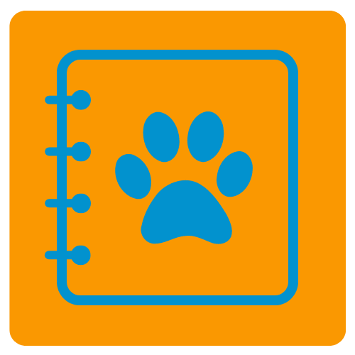

# PeJo

### A web application that helps you keep your pet healthy and happy!

This is a web application thought for users that have pets and need an intelligent software solution
to manage the different responsibilities related to having a pet.

The main components of the application are:

- Reminder: 
  - It contains a calendar type of functionality in which the owner can enter different appointments and
    reminders regarding the pet (vaccination schedules, deworming, health checks and so on).

- Tips:
  - Contains some recommendations regarding:
    - Pet care 
    - Pet sitting possibilities (might include app users)
    - Travel with pets

- Locate:
  - With this functionality you can find useful google map information regarding:
    - Veterinaries
    - Shops
    - Pet Saloons
    - Dog zones

- ToDo:
  - User is able to make its own list of things to do which can be related to the reminders

- Documentation:
  - User is able to store relevant documentation regarding their pets such as certification of vaccinations, blood tests
    and medications